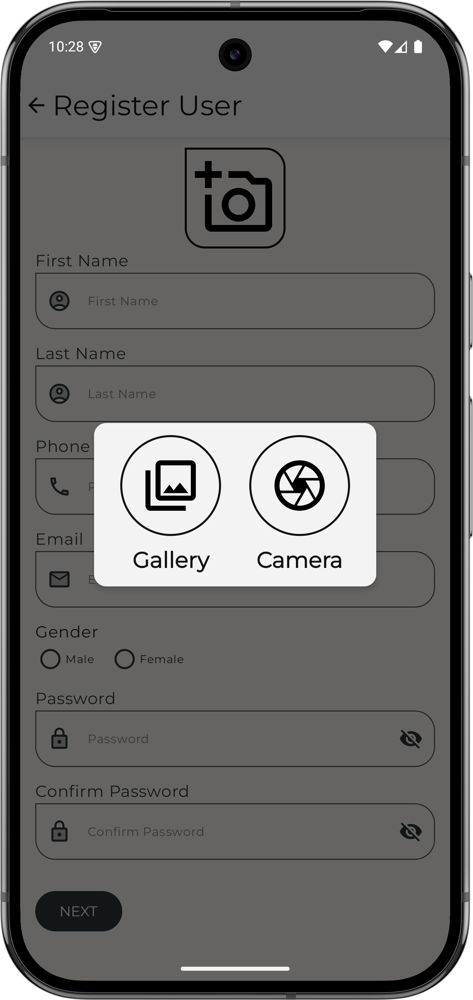

# Android Assessment App

This project is the completed assessment for an Android application that registers a user based on their **professional**, **educational**, **address**, and **personal** information. The app is built using **Jetpack Compose** and follows **MVVM with Clean Architecture** principles to ensure scalability, maintainability, and modularity.

---
##  Screenshot
<table>
  <tr>
    <td></td>
    <td></td>
    <td></td>
    <td></td>
    <td></td>
    <td></td>
  </tr>
</table>

## 🚀 Features

- **Jetpack Compose UI**: Modern UI toolkit for building native Android interfaces using declarative Kotlin APIs.
- **Room Database**:
    - Implements relational database concepts with **foreign key relationships**.
    - Designed to support **future scalability**.
- **Navigation Component**:
    - Utilizes **NavHost** for managing screen transitions.
- **Global SnackBar System**:
    - Centralized and reusable snack bar implementation for displaying messages across the app.
- **Dagger Hilt for Dependency Injection**:
  - Simplifies dependency management and lifecycle-aware injection across the app.
  - Used following annotation @Provide @Inject @HiltViewModel @Singleton etc
  - Utilised @AssistedInject @Assisted & @AssistedFactory for runtime injection of dependencies. 
- **MVVM + Clean Architecture**:
    - Follows a clean separation of concerns.
    - Organized into data, domain, and presentation layers for better testability and maintainability.

# Video


## 📱 How to Run
1. Clone the repository:
   ```bash
   git clone https://github.com/your-username/android-assessment-app.git